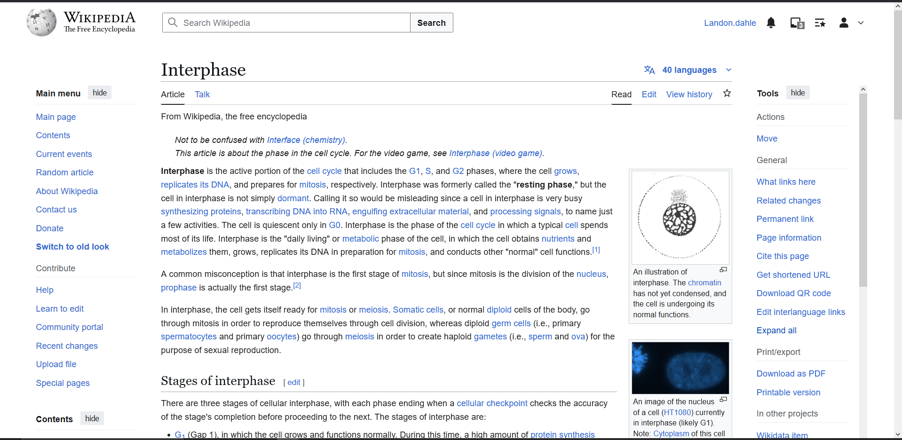
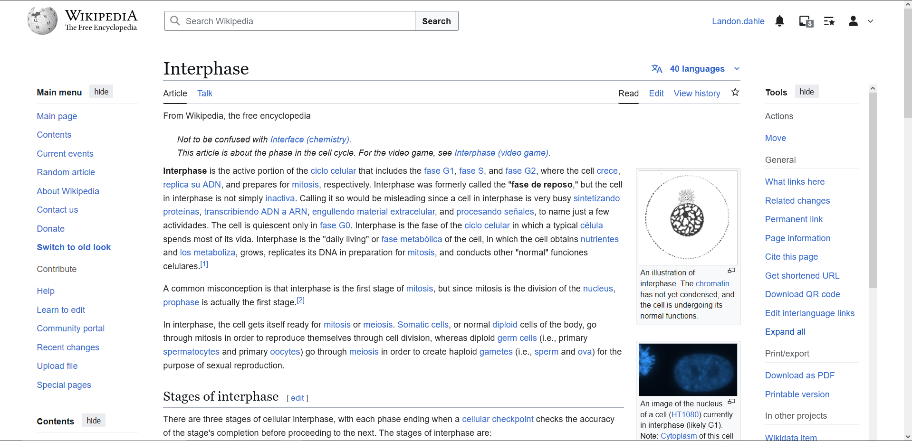

# Interphrase — Firefox Extension (LibreTranslate Enhanced)

## ✨ What is Interphrase?

**Interphrase** is a lightweight browser extension that helps you learn new languages *passively* by replacing words and phrases on webpages as you browse. It offers both:
- **Custom dictionary-based word swaps**
- **Optional full-page translation** via the [LibreTranslate](https://libretranslate.com) API

No pop-ups, no quizzes — just immersive exposure to your target language, everywhere you go online.

---

## 🔍 Features

- 🔤 Swap specific terms using your own custom dictionary  
- 🌐 Auto-translate full pages with LibreTranslate (free tier, no API key required)  
- ⚙️ Toggle modes and manage settings with a simple UI  
- 🧠 Learn languages naturally, without breaking your web flow  

---

## 🧪 Demo

| Before | After (Spanglish) |
|--------|-------------------|
|  |  |

> A real example of Interphrase swapping biology terms on an English Wikipedia article.  
> Notice gentle substitution of terms like *"cell cycle" → "ciclo celular"*, *"grows" → "crece"*, etc., for passive learning in context.

---

## 🔧 API Integration

Uses [LibreTranslate](https://libretranslate.com) for full-page translation.  
No API key is needed for basic public access.

**If self-hosting LibreTranslate**, update the API endpoint in:

```js
// contentScript.js
const LIBRE_TRANSLATE_URL = "http://localhost:5000/translate";
```

## 🚀 Installation
1. Open Firefox and go to about:debugging
2. Click "This Firefox" → "Load Temporary Add-on"
3. Select any file inside your Interphrase extension folder

## 🛠️ Future Plans
- Batch processing for phrase-based swaps
- Highlight or tooltip overlays for educational prompts
- Optional themes (e.g. fantasy mode, sci-fi, minimalist UI)
- Open glossary archive & translation jam sessions

---

Made with ❤️ by a solo developer trying to survive and make learning magical again.